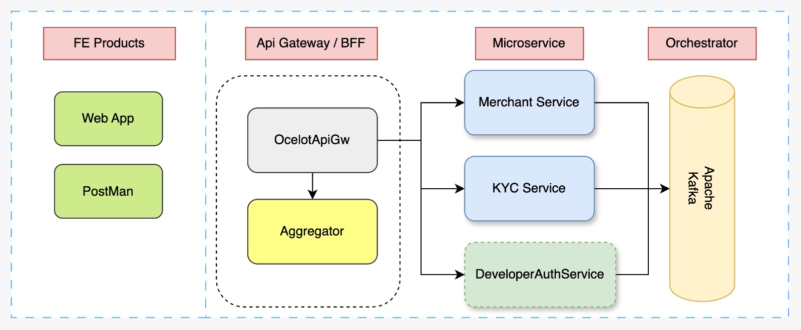

# About
Dotpay is a sandbox payment gateway developed using C# and .NET framework.

# Overview
Dotpay consist of multiple resources such as:
1. Merchant
2. Customers
3. Balance 
4. Charges
5. Payment Intent

# Consideration I have when developing dotpay
- Good DX
- CICD Implementation
- Harness value from monorepo 
- Industry standard

# Project Architecture 

# Motivation
1. Learning the ins and outs of payment gateway
2. Practice to implement industry level code standard 
3. Implement industry level cicd workflow
4. Learning product development
